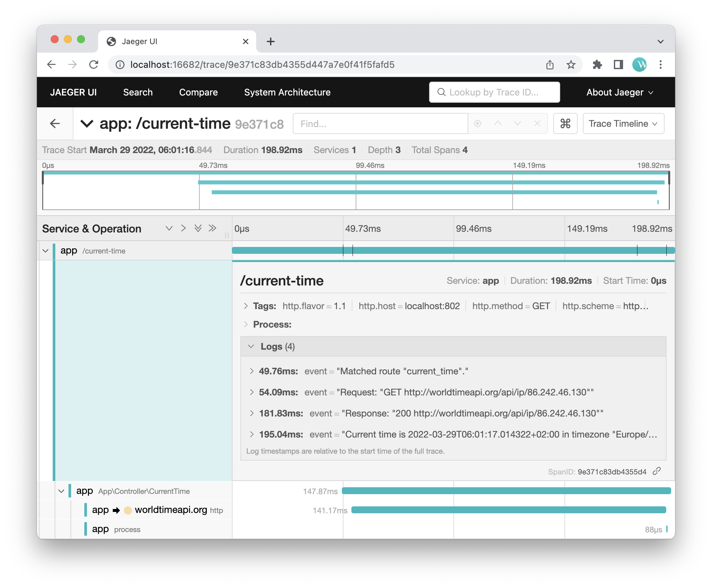

# Static usage example



```php
<?php

namespace App\Controller;

use Instrumentation\Tracing\Tracing;
use OpenTelemetry\API\Trace\SpanKind;
use Symfony\Component\HttpFoundation\Request;
use Symfony\Component\HttpFoundation\Response;
use Symfony\Contracts\HttpClient\HttpClientInterface;

class CurrentTime
{
    public function __construct(private HttpClientInterface $httpClient)
    {
    }

    public function __invoke(Request $request): Response
    {
        $ip = $request->getClientIp();

        $span = Tracing::trace('http', ['net.peer.name' => 'worldtimeapi.org'], SpanKind::KIND_CLIENT);
        $info = $this->httpClient->request('GET', 'http://worldtimeapi.org/api/ip/' . $ip)->toArray();
        $span->end();

        $span = Tracing::trace('process');
        $result = sprintf('Current time is %s in timezone "%s".', $info['datetime'], $info['timezone']);
        sleep(1);
        $span->end();

        return new Response($result);
    }
}
```
